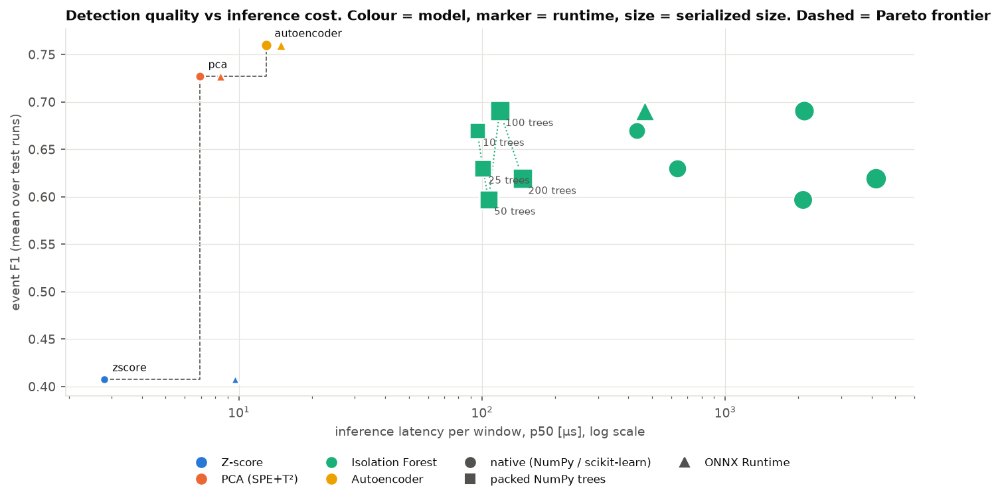
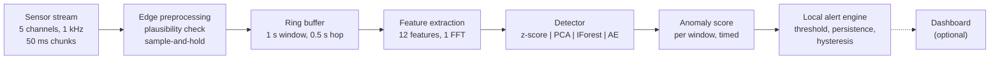
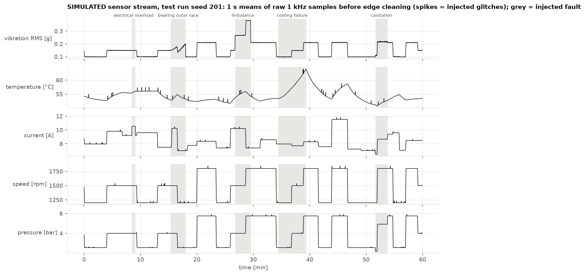
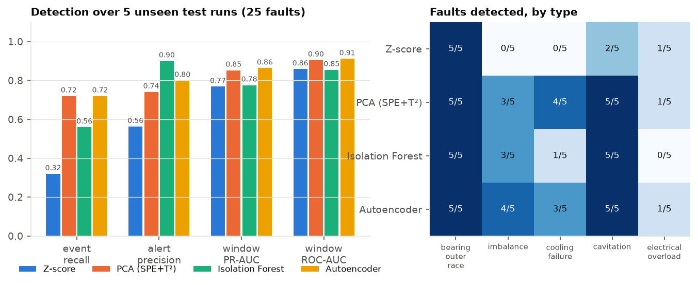
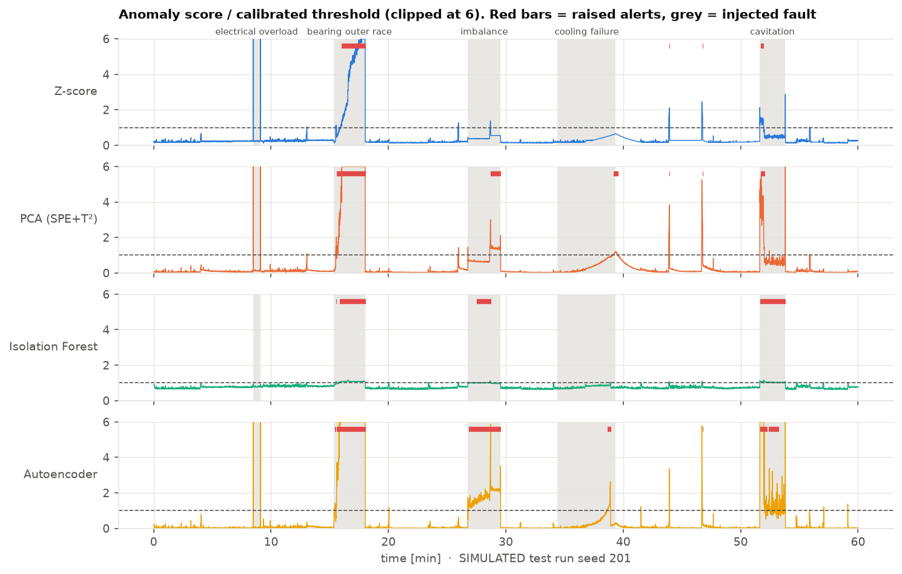
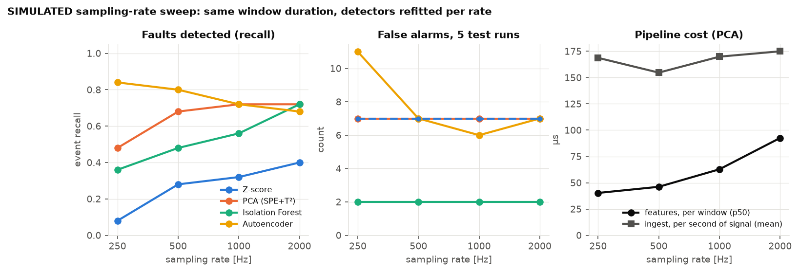

<div align="center">

# Edge AI Condition Monitor
### Real-Time Equipment Health Monitoring at the Edge

**How much detection quality does a lightweight anomaly detector give up to run cheaply next to the machine?**

A streaming condition-monitoring prototype: sensor stream, edge preprocessing, features, four one-class detectors,
alerting, and measured cost per window. Evaluated on a documented simulated machine and on real metro-compressor data.

[](https://github.com/Ilyess911/edge-ai-condition-monitor/actions/workflows/tests.yml)


[](LICENSE)

</div>



<sub>Simulated track, 5 unseen one-hour test runs, 25 injected faults. Latency measured on a laptop core (Apple M4, one thread), not on an edge device.</sub>

---

## Research Question

> **Can lightweight anomaly detection models provide effective equipment condition monitoring under edge-computing constraints?**

Operationally: for each detector, what is detected (faults found, false alarms, delay) and what it costs
(latency per window, throughput, size, memory, CPU share), measured in the same streaming loop.

**Short answer from the measurements below:**

1. On a simulated machine, detectors that model sensor correlations (PCA, a small autoencoder) find **18/25**
   faults with **under 100 µs** per window on a laptop core. Per-feature alarm limits find **8/25** at similar cost.
2. **Runtime choice matters more than model choice.** The same Isolation Forest costs **2.1 ms** per window in
   scikit-learn and **118 µs** as exported arrays, with identical scores.
3. On **real** compressor data (MetroPT-3), three detectors flag **4/4** reported air leaks, well above chance, but
   stay **in alarm 9-16 % of healthy time**. Ranking faults is not the hard part; calibrating alerts under drift is.

## Why Edge AI for Industrial Monitoring?

Condition monitoring runs close to the machine when alerts must survive a network outage and raw data is too heavy
to ship. At 1 kHz, five channels are 40 kB/s as float64; twelve features every 0.5 s are 192 B/s. The price is a
small compute budget, which is why cost is measured next to detection in every experiment.

## Architecture



Code path: `src/streaming/engine.py` calls `src/preprocessing` → `src/features` → `src/models` → `src/alerts`.
Training features go through the **same engine** as test features (tested against an offline reference).

## Sensor Stream

| | Simulated rotating machine | MetroPT-3 |
|---|---|---|
| Nature | **SIMULATED**, `src/data/simulator.py` | **REAL**, metro train air compressor, 2020 ([UCI 791](https://archive.ics.uci.edu/dataset/791/metropt+3+dataset), CC BY 4.0) |
| Channels | vibration, temperature, current, speed, pressure | 7 analog + 8 digital |
| Rate | 1 kHz (swept 250-2000 Hz), anti-aliased decimation from 4 kHz | 0.1 Hz (10 s median interval, checked in the file) |
| Ground truth | 5 fault types, exact onsets, random severity | 4 company air-leak reports |
| Why | exact labels, kHz vibration, controlled sampling | checks the pipeline on data nobody designed |



Normal operation is non-stationary (speed and load steps with 5 s ramps), and sensor dropouts and glitches are
injected and labelled normal. Faults: bearing outer-race defect, imbalance, cooling failure, cavitation, electrical
overload. Physics, constants and their limits: [`docs/data.md`](docs/data.md).

## Models

All four are **one-class**: fitted on healthy data only, because failures are rare and unlabelled in practice.

| Model | Why it is in the comparison | Score | Parameters |
|---|---|---|---|
| **Z-score** | baseline: what per-sensor alarm limits do | max \|z\| over features | 24 |
| **PCA (SPE + T²)** | classical multivariate process monitoring; models correlations linearly | combined index SPE/δ² + T²/τ² | 78 |
| **Isolation Forest** | standard non-parametric anomaly baseline; no scaling, bounded depth | mean isolation path length | 35,125 |
| **Autoencoder** 12-8-3-8-12 | only as the non-linear counterpart of PCA: does non-linearity buy detection? | reconstruction error | 295 |

Three runtimes are compared for the same fitted models: NumPy / scikit-learn, **ONNX Runtime** (all four exported,
parity-tested) and **packed NumPy arrays** for the forest (`src/inference/packed_forest.py`, exact score parity).

## Real-Time Inference Engine

This is an **online inference simulation** (soft real-time at best): data is replayed from memory in 50 ms chunks,
either **paced** at the sensor clock or **unpaced** as fast as possible. CPython and macOS give no latency guarantee;
the engine measures lateness behind the sensor clock instead of assuming it is zero.

- **Preprocessing:** per-channel plausibility range, missing values held for at most 1 s, state carried across chunks
  (output independent of chunk size, tested).
- **Windowing:** fixed circular buffer, memory O(window) whatever the stream length.
- **Threshold:** 99.5th percentile of scores on a separate 30-minute healthy calibration run, no fault labels.
- **Persistence:** alert after *k* consecutive windows over threshold, *k* = longest healthy excursion + 1 on the
  calibration run (cap 10 s); cleared after 5 windows under threshold.

## Experimental Setup

| | |
|---|---|
| Simulated splits | train 60 min (seed 1), calibration 30 min (seed 2), development seed 101 (debugging only), **test seeds 201-205** (5 x 60 min, 25 faults), untouched until the benchmark |
| MetroPT-3 split | chronological: train Feb 1 to Mar 15, calibration Mar 15 to Apr 1, test Apr 1 to Sep 1 2020; fixed before evaluation |
| Detection metrics | faults detected, alert precision, event F1, false alarms per hour, **healthy time in alarm**, mean delay, window ROC-AUC and PR-AUC |
| Chance control | real alerts shifted to random circular offsets; detections expected by luck and p-value |
| Machine | Apple M4 laptop, macOS 26.5, Python 3.12.13, NumPy 2.5.3, scikit-learn 1.9.1, ONNX Runtime 1.30.0 |
| Threads | 1 (BLAS and ONNX Runtime pinned) |
| Latency method | `perf_counter_ns` around each stage, per window, first 20 windows per run discarded, 35,895 windows per variant, µs |
| Background load | other processes were running; 1-minute load average 2.8 at start, 22.8 at end (recorded in the JSON) |

Two latencies are never mixed: **model inference** (`detector.score` on one feature vector) and **window pipeline**
(features + inference + alert).

## Edge Benchmark

SIMULATED track, 1 kHz, 25 faults over 5 test runs. Laptop measurements.

| Model | Runtime | Faults detected | Event F1 | False alarms / h | Inference p50 / p99 | Pipeline p50 / p99 | Throughput | Size | Deployment class (rule, untested) |
|---|---|---|---|---|---|---|---|---|---|
| Z-score | NumPy | 8/25 | 0.41 ± 0.13 | 2.64 | 2.8 / 3.4 µs | 65 / 75 µs | 3.3 M samples/s | 0.4 KiB | MCU-portable |
| PCA | NumPy | **18/25** | 0.73 ± 0.15 | 2.64 | 6.9 / 8.6 µs | 70 / 80 µs | 3.2 M samples/s | 1.0 KiB | MCU-portable |
| Autoencoder | NumPy | **18/25** | **0.76 ± 0.05** | 2.26 | 13 / 19 µs | 100 / 138 µs | 2.3 M samples/s | 2.8 KiB | MCU-portable |
| Isolation Forest | scikit-learn | 14/25 | 0.69 ± 0.08 | **0.79** | 2111 / 8570 µs | 2201 / 9048 µs | 0.18 M samples/s | 1253 KiB | gateway |
| Isolation Forest | packed NumPy | 14/25 | 0.69 ± 0.08 | **0.79** | 118 / 261 µs | 260 / 576 µs | 1.1 M samples/s | 592 KiB | SBC / gateway |
| Isolation Forest | ONNX Runtime | 14/25 | 0.69 ± 0.08 | **0.79** | 466 / 1133 µs | 541 / 1341 µs | 0.70 M samples/s | 861 KiB | SBC / gateway |

"Deployment class" is a stated rule, not a hardware result: matrix or table models under 256 KiB serialized are
marked MCU-portable. Z-score, PCA and autoencoder under ONNX Runtime: 9.7, 8.4 and 14.9 µs p50, same detections.
At the 1 kHz sensor rate (paced replay), every variant used **under 2 % of one core** (0.35-1.73 %).
Full tables: [`results/summary.md`](results/summary.md), [`docs/experiments.md`](docs/experiments.md).

**Measurement caveats, stated up front:** identical feature-extraction code varied from 62 to 140 µs p50 between
variants as background load changed, so differences under about 2x are noise. Paced replay made each call
**1.5-2.6x slower** than the hot loop used for this table (EXP-010).

## Results

### Detection



| Finding | Evidence |
|---|---|
| Correlations matter more than model class | PCA and autoencoder 18/25, z-score 8/25. Z-score misses every imbalance and cooling failure: vibration RMS and temperature also change with normal speed and load steps, so only their relation to speed and current is abnormal |
| Non-linearity did not buy detection | autoencoder 18/25 = PCA 18/25; event F1 0.76 ± 0.05 vs 0.73 ± 0.15, not separable with 25 events |
| Isolation Forest is the conservative one | 0.79 false alarms/h vs 2.3-2.6, but 1/5 cooling failures |
| Detections are not luck | same alerts at random offsets would hit 7.5 (PCA) and 7.9 (autoencoder) faults, against 18 observed |
| Label-free persistence works | fixed 3-window rule: Isolation Forest 10.47 false alarms/h; calibrated rule: 0.79 |
| One fault is invisible by design | electrical overload found 0-1/5: load is not measured, so extra current looks like extra load |



### Real data: MetroPT-3

| Model | Reports detected | Expected by chance (p) | False alarms / day | **Healthy time in alarm** | ROC-AUC |
|---|---|---|---|---|---|
| Z-score | 4/4 | 1.23 (p = 0.006) | 0.18 | **16.4 %** | 0.952 |
| PCA | 4/4 | 1.19 (p = 0.007) | 0.16 | **16.0 %** | 0.959 |
| Autoencoder | 4/4 | 1.00 (p = 0.007) | 0.16 | **8.6 %** | 0.938 |
| Isolation Forest | 1/4 | 0.16 (p = 0.157) | 0.01 | 0.9 % | **0.987** |


The false-alarm count looks acceptable; time in alarm does not. August alarms trace to the digital `Oil_level`
channel changing state (plus +6 °C seasonal oil temperature). Removing that feature **after the fact** (EXP-009,
labelled post-hoc) keeps 4/4 detections and cuts time in alarm to about 4.4 %. Whether August is drift or an
unreported condition cannot be decided from the data. The best ranker (Isolation Forest, ROC-AUC 0.987) is the worst
alerter (1/4, not distinguishable from chance): its scores sit in a narrow band under a static threshold.

## Performance vs Latency

**How much detection must be given up for faster, lighter inference?**


- **Along the Pareto frontier, nothing.** Z-score → PCA → autoencoder costs 2.8 → 6.9 → 13 µs and buys 8 → 18 → 18
  faults. PCA gets the detection of the non-linear model at half its inference time and one third of its size.
- **Isolation Forest is dominated on this data:** fewer faults than PCA at 17x (packed) to 300x (scikit-learn) the
  inference time, with the lowest false-alarm rate as its one advantage.
- **Forest size does not buy detection:** 10 trees find 15/25 in 52 KiB, 100 trees 14/25 in 592 KiB, 200 trees
  12/25 in 1183 KiB.
- **Inference is not the bottleneck of the pipeline.** Feature extraction (one FFT and eleven statistics) takes about
  60 µs per window, ten times PCA inference.



Sampling rate is set by fault physics, not compute. Going from 250 to 2000 Hz multiplies samples by 8 but feature
cost by 2.3. Below 1 kHz the simulated 350 Hz bearing resonance is filtered out, and PCA drops from 18/25 to
12/25 at 250 Hz.

## Demo

```bash
uv run python scripts/stream_demo.py --speed 6      # SIMULATED 3-minute stream, PCA, paced at 6x the 1 kHz clock
```

Excerpt of an actual run (`results/logs/stream_demo.log`):

```text
model=pca threshold=3.822 raise_after=10 fs=1000 Hz window=1000 hop=500 chunk=50
SIMULATED stream, injected faults: imbalance @ 50-85 s, bearing_outer_race @ 120-170 s
 t [s]  vib rms   temp   curr  score/threshold        state       infer
    50    0.211   54.3   8.62  .................... OK         41.9us  <- fault active
    51    0.533   54.3   8.61  #################### WARNING    39.0us  <- fault active
    55    0.533   54.3   8.61  #################### ALARM      39.0us  <- fault active
   129    0.218   54.1   8.61  ############........ WARNING    40.5us  <- fault active
   133    0.224   54.2   8.61  #################### ALARM      38.9us  <- fault active

alert history
  ALARM   55.0 s ->   88.0 s  peak score 22.78
  ALARM  133.0 s ->  173.0 s  peak score 320.11
```

The imbalance is flagged 5 s after onset (the 10-window persistence). The progressive bearing defect takes 13 s.
Inference in this paced, printing demo is about 40 µs, above the hot-loop benchmark, as EXP-010 predicts.

Optional dashboard (same engine, live score, health state, alert history, latency):

```bash
uv run streamlit run src/dashboard/app.py
```

## Repository Structure

```text
edge-ai-condition-monitor/
├── configs/                  simulated.toml, metropt.toml (frozen before test evaluation)
├── src/
│   ├── data/                 simulator (SIMULATED) and MetroPT-3 loader with failure reports
│   ├── preprocessing/        plausibility check + sample-and-hold, circular sliding window
│   ├── features/             12 vibration/process features, 14 compressor duty-cycle features
│   ├── models/               z-score, PCA, Isolation Forest, autoencoder
│   ├── inference/            label-free threshold + persistence, ONNX export, packed forest
│   ├── streaming/            streaming engine with per-stage timing, paced/unpaced replay
│   ├── alerts/               alert engine (persistence, hysteresis)
│   ├── benchmarking/         detection metrics, chance control, profiling, simulated track
│   └── dashboard/            optional Streamlit app
├── scripts/                  benchmark, sweep, MetroPT-3, paced check, figures, summary, demo
├── tests/                    34 tests: parity, chunk invariance, streaming = offline, metrics
├── results/                  JSON of every measurement, summary.md, raw logs
├── assets/                   figures, all regenerated by scripts/make_figures.py
└── docs/                     data, experiments, hardware path, interview notes, research extension
```

## Quick Start

```bash
git clone https://github.com/Ilyess911/edge-ai-condition-monitor.git
cd edge-ai-condition-monitor
uv sync --all-extras
uv run pytest                                          # 34 tests, under 20 s
uv run python scripts/stream_demo.py --speed 6         # terminal demo
uv run python scripts/run_benchmark.py --quick         # development seed only, a few minutes
make reproduce                                         # every result and figure (downloads MetroPT-3, 218 MB)
```

## Hardware Deployment Path

**Not deployed on any hardware.** [`docs/hardware_deployment.md`](docs/hardware_deployment.md) separates what is
implemented (single-threaded runtimes, ONNX export with parity tests, flat-array forest, fixed-memory streaming)
from what is proposed (Raspberry Pi, Jetson and gateway runs, C port, quantization, power measurement, real sensor
interfaces), and what each would change.

## Limitations

- **No edge hardware.** All latency, throughput and CPU figures come from a laptop core with background load.
  They rank runtimes; they do not predict ARM numbers.
- **Hot-loop latency is optimistic** by 1.5-2.6x compared with paced operation on this machine.
- **The simulator is mine.** Detector rankings on it are not evidence about real machines; its bearing resonance is
  scaled down to 350 Hz. It serves exact onsets and sampling experiments.
- **Four real failure events.** MetroPT-3 detection counts carry large uncertainty; the chance control helps but
  cannot add events. Nothing guarantees the training months were healthy, only that no failure was reported.
- **Static models and thresholds.** Drift is observed (MetroPT-3 August), not handled.
- **One post-hoc result** (EXP-009), labelled as such.
- **Not hard real-time.** CPython, garbage collection and a desktop OS; lateness measured, never bounded.
- **Preprocessing handles only out-of-range values and short gaps**, not clock drift, reordering or stuck sensors.
- **Power not measured.**

## Future Research

Proposed, not implemented. Detailed 12-week plan: [`docs/research_extension.md`](docs/research_extension.md).

1. **Label-free threshold adaptation under drift** (sliding conformal quantiles, EVT tails) on MetroPT-3 August,
   with updates frozen during alarms.
2. **Paced benchmark on a Raspberry Pi 5 and a Cortex-M board**, with power measurement.
3. **Real kHz vibration** (bearing test data at native rate) in place of the simulated channel.
4. **TinyML path:** C port of the features and PCA / packed-forest scoring, int8 autoencoder with recalibration.

---

<div align="center">
<sub>Ilyess Assadi · ESILV Industry 4.0 & Robotics · MIT licence · MetroPT-3 data © Veloso et al., CC BY 4.0</sub>
</div>
