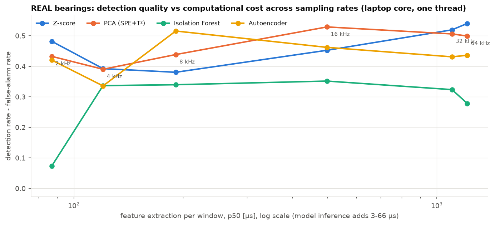
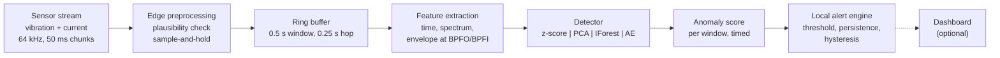
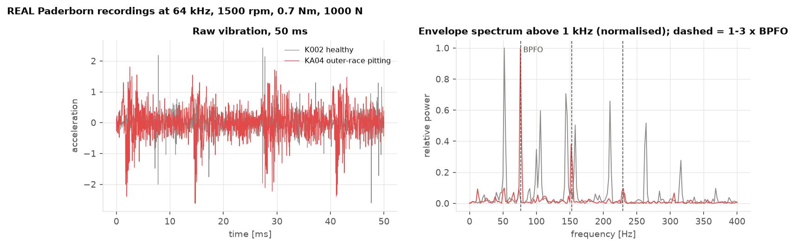
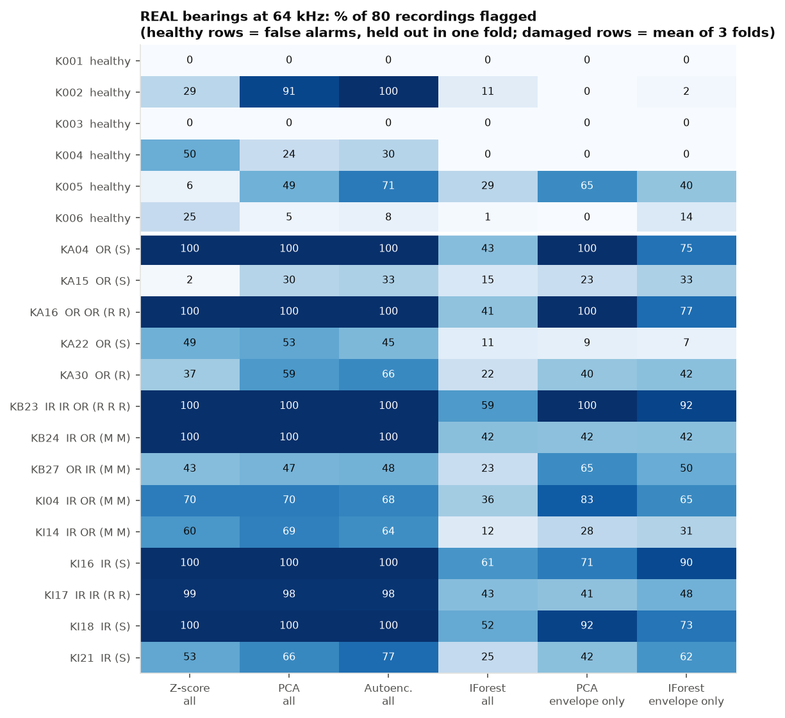
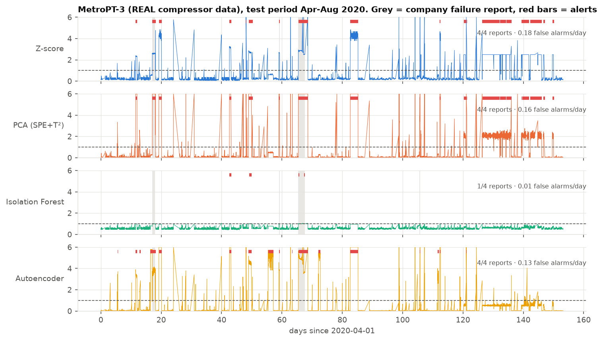
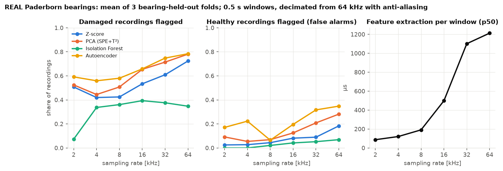
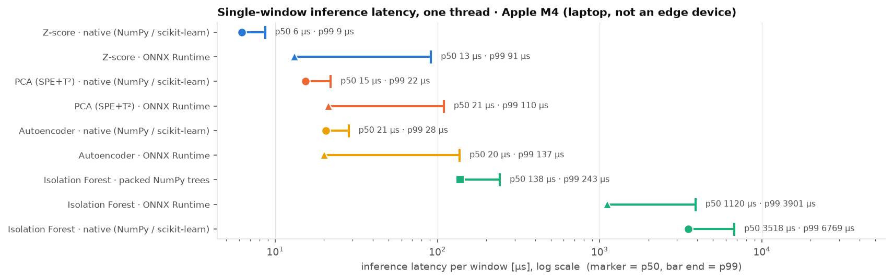

<div align="center">

# Edge AI Condition Monitor
### Real-Time Equipment Health Monitoring at the Edge

**How much detection quality does a lightweight anomaly detector give up to run cheaply next to the machine?**

A streaming condition-monitoring prototype, evaluated on real bearing vibration at 64 kHz and on months of real
compressor data: sensor stream, edge preprocessing, features, four one-class detectors, alerting, and measured cost
per window.

[](https://github.com/Ilyess911/edge-ai-condition-monitor/actions/workflows/tests.yml)


[](LICENSE)

</div>



<sub>Real Paderborn bearings, 3 bearing-held-out folds. Cost measured on a laptop core (Apple M4, one thread), not on an edge device.</sub>

---

## Research Question

> **Can lightweight anomaly detection models provide effective equipment condition monitoring under edge-computing constraints?**

For each detector: what it detects (damaged recordings, failures, false alarms, time in alarm) and what it costs
(latency per window, throughput, size, CPU share), measured in the same streaming loop.

**Short answer from the measurements below:**

1. **On real bearings at 64 kHz,** PCA and a small autoencoder flag **78 %** of recordings from damaged bearings but
   also **28-35 %** of recordings from healthy bearings they never saw. Healthy bearings differ from each other almost
   as much as from damaged ones.
2. **Physics-based features buy sobriety, not recall.** Using only envelope energy at the bearing defect frequencies,
   PCA's false alarms drop from **28 % to 11 %** for 60 % detection, and Isolation Forest's detection rises from 35 % to 56 %.
3. **The sampling rate buys feature cost, not model cost.** A window costs about **1.2 ms** at 64 kHz, of which the
   model is **3-54 µs**. At 16 kHz, PCA's detection minus false alarms is slightly better (0.53 vs 0.50) at 41 % of the feature cost.
4. **On months of real compressor data (MetroPT-3),** three detectors flag **4/4** reported failures, well above chance,
   yet stay **in alarm 9-16 % of healthy time**. Ranking is not the hard part; calibrating alerts under drift is.

## Why Edge AI for Industrial Monitoring?

At 64 kHz a single accelerometer produces 512 kB/s as float64; the 15 features of one window every 0.25 s are
480 B/s. Keeping acquisition, features and alerts next to the machine removes the bandwidth problem and keeps
alerts alive during network outages, at the price of a small compute budget. That budget is why cost is measured
next to detection in every experiment.

## Architecture



Code path: `src/streaming/engine.py` calls `src/preprocessing` → `src/features` → `src/models` → `src/alerts`.
Training and test features come out of the **same engine**; tests check it against an offline reference and check
that replayed alerts match the full engine.

## Data

| | **Paderborn bearings** | **MetroPT-3** | Simulated machine |
|---|---|---|---|
| Nature | **REAL** test bench, Paderborn University (KAt) | **REAL** metro air compressor, 2020 ([UCI 791](https://archive.ics.uci.edu/dataset/791/metropt+3+dataset)) | **SIMULATED** (`src/data/simulator.py`) |
| Signals | vibration + motor current at **64 kHz**, speed, torque, force | 15 channels at 0.1 Hz | 5 channels at 1 kHz |
| Ground truth | 6 healthy bearings, 14 with **real damage** from accelerated lifetime tests | 4 company failure reports | exact fault onsets |
| Used for | detection vs cost, sampling rate, feature ablation | drift, alert calibration over months | detection delay, runtime comparison |



The damaged bearing's envelope spectrum peaks exactly at the outer-race defect frequency (BPFO) and its harmonics.
The healthy bearing shows other periodic lines from the rig. Details, checks and caveats: [`docs/data.md`](docs/data.md).

## Models

All four are **one-class**: fitted on healthy data only, because failures are rare and unlabelled in practice.

| Model | Why it is in the comparison | Score |
|---|---|---|
| **Z-score** | baseline: what per-sensor alarm limits do | max \|z\| over features |
| **PCA (SPE + T²)** | classical multivariate process monitoring; models correlations linearly | combined index SPE/δ² + T²/τ² |
| **Isolation Forest** | standard non-parametric anomaly baseline; no scaling, bounded depth | mean isolation path length |
| **Autoencoder** 8-3-8 | only as the non-linear counterpart of PCA: does non-linearity buy detection? | reconstruction error |

Runtimes compared for the same fitted models: NumPy / scikit-learn, **ONNX Runtime** (all four exported,
parity-tested), and **packed NumPy arrays** for the forest (exact score parity with scikit-learn).

## Real-Time Inference Engine

This is an **online inference simulation** (soft real-time at best): recordings are replayed from memory in 50 ms
chunks, either **paced** at the sensor clock or **unpaced** as fast as possible. CPython and macOS give no latency
guarantee; the engine measures lateness behind the sensor clock instead of assuming it is zero.

- **Preprocessing:** per-channel plausibility range, bounded sample-and-hold, state carried across chunks.
- **Windowing:** fixed circular buffer; on Paderborn the engine is reset between recordings, which are not continuous.
- **Threshold:** 99.5th percentile of scores on held-out healthy calibration data, no fault labels.
- **Persistence:** alert after *k* consecutive windows over threshold, *k* = longest healthy excursion + 1.

## Benchmark Methodology

| | |
|---|---|
| Paderborn protocol | 3 folds; healthy bearings rotate between training (3), calibration (1) and **held-out test (2)**; all 14 damaged bearings tested in every fold; **no bearing in two roles**. A 4 s recording is flagged if an alert is raised in it |
| MetroPT-3 protocol | chronological: train Feb 1 to Mar 15, calibration Mar 15 to Apr 1, test Apr 1 to Sep 1 2020 |
| Simulated protocol | train and calibration seeds 1-2, development seed 101, test seeds 201-205 untouched until the benchmark |
| Controls | chance level by circular shift of alerts (MetroPT-3, simulator); healthy bearings held out (Paderborn); feature-group ablation; runtime score parity |
| Machine | Apple M4 laptop, macOS 26.5, Python 3.12.13, NumPy 2.5.3, scikit-learn 1.9.1, ONNX Runtime 1.30.0, **one thread** |
| Latency | `perf_counter_ns` per window around each stage; **model inference** (`detector.score` alone) is reported separately from the **window pipeline** (features + inference + alert) |
| Caveats | background load recorded in every JSON; identical code varied up to 2x between runs; paced replay is 1.5-2.6x slower per call than a hot loop (EXP-010); the laptop slept once during a run (latencies unaffected) |

## Results

### 1. Real bearings (Paderborn, 64 kHz)

| Model | Damaged recordings flagged | Healthy recordings flagged | Window ROC-AUC | Inference p50 | Pipeline p50 / p99 | Real-time factor | Paced CPU |
|---|---|---|---|---|---|---|---|
| Z-score | 72 ± 5 % | **18 ± 5 %** | 0.860 | 3.2 µs | 1213 / 1297 µs | 176x | 4.2 % |
| PCA | **78 ± 15 %** | 28 ± 14 % | **0.868** | 7.5 µs | 1201 / 1980 µs | 176x | 3.9 % |
| Autoencoder | **78 ± 17 %** | 35 ± 15 % | 0.860 | 9.8 µs | 1179 / 1232 µs | 181x | 3.9 % |
| Isolation Forest (packed) | 35 ± 29 % | **7 ± 6 %** | 0.795 | 54 µs | 1221 / 2040 µs | 174x | 4.0 % |

<sub>± = standard deviation over 3 folds. Isolation Forest through scikit-learn: 1706 µs inference, 83x real time. Laptop measurements.</sub>



| Finding | Evidence |
|---|---|
| Healthy bearings are the hard part | with all features, PCA flags healthy **K002 on 91 %** of its recordings and healthy K001 on 0 %; vibration kurtosis ranges from 5.1 to 14.8 across the four healthy bearings checked |
| Physics-based features remove most mounting effects | envelope + context only: K001-K004 and K006 at **0 %**, false alarms 28 → 11 % (PCA) |
| One healthy bearing resists | K005 is flagged on 65 % of recordings by envelope features: left unexplained, not tuned away |
| Some real damage is nearly invisible | KA15 (single outer-ring pitting, extent 1): 23-30 % of recordings flagged by PCA |
| Clear damage is found by everything | KA04, KA16, KB23: 100 % with PCA, all features or envelope only |

### 2. Months of real operation (MetroPT-3)

| Model | Reports detected | Expected by chance (p) | False alarms / day | **Healthy time in alarm** | ROC-AUC |
|---|---|---|---|---|---|
| Z-score | 4/4 | 1.23 (p = 0.006) | 0.18 | **16.4 %** | 0.952 |
| PCA | 4/4 | 1.19 (p = 0.007) | 0.16 | **16.0 %** | 0.959 |
| Autoencoder | 4/4 | 1.00 (p = 0.007) | 0.16 | **8.6 %** | 0.938 |
| Isolation Forest | 1/4 | 0.16 (p = 0.157) | 0.01 | 0.9 % | **0.987** |



The false-alarm count looks acceptable; time in alarm does not. August alarms trace to the digital `Oil_level` channel
changing state plus a seasonal oil-temperature rise. Removing that feature **after the fact** (EXP-009, labelled
post-hoc) keeps 4/4 and cuts time in alarm to about 4.4 %. Drift or unreported condition cannot be decided from the data.

### 3. Controlled experiments (SIMULATED machine)

Used for what real data here cannot give: exact onset times and a clean runtime comparison. 25 injected faults over
5 unseen one-hour runs, 1 kHz.

| Model | Faults detected | Chance level | False alarms / h | Mean detection delay |
|---|---|---|---|---|
| Z-score | 8/25 | 4.2 | 2.64 | 51 s |
| PCA | 18/25 | 7.5 | 2.64 | 76 s |
| Autoencoder | 18/25 | 7.9 | 2.26 | 55 s |
| Isolation Forest | 14/25 | 5.6 | 0.79 | 35 s |

Label-free persistence cut Isolation Forest's false alarms from 10.47 to 0.79 per hour compared with a fixed
3-window rule (EXP-005). One simulated fault (electrical overload) is unobservable by design and is missed.

## Performance vs Latency

**How much detection must be sacrificed to obtain faster and lighter edge inference?**



| Rate | Feature p50 | PCA detected / false | Isolation Forest detected / false |
|---|---|---|---|
| 64 kHz | 1213 µs | 78 / 28 % | 35 / 7 % |
| 16 kHz | 498 µs | 65 / 12 % | 39 / 4 % |
| 8 kHz | 191 µs | 51 / 7 % | 36 / 2 % |
| 2 kHz | 87 µs | 52 / 9 % | 7 / 0 % |

- **The expensive part of edge inference here is the signal processing, not the model.** At 64 kHz the Fourier
  transforms of the feature stage take about 1.2 ms per window; PCA inference takes 7.5 µs.
- **Lowering the sampling rate trades detections for false alarms**, not simply quality for cost. 16 kHz keeps
  most of PCA's balanced performance (detection minus false alarms 0.53 vs 0.50 at 64 kHz) at 41 % of the feature cost.
- **Below 8 kHz, cost savings flatten** (191 → 87 µs) while Isolation Forest collapses to 7 % detection at 2 kHz.
- **Runtime matters more than model class for tree ensembles.** The same forest costs 1706 µs per window in
  scikit-learn and 54 µs as packed arrays, with identical scores; for linear models ONNX Runtime adds no speed.



<sub>Runtime comparison on the simulated track (same models, same scores, three runtimes).</sub>

## Demo

**Dashboard on real bearings** (needs `make paderborn`):

```bash
uv run streamlit run src/dashboard/app.py
```

Pick a fold, a detector, a feature set and a sampling rate; the monitor is fitted and calibrated exactly as in
that benchmark fold. Then replay a bearing it never saw (a held-out healthy one or one of the 14 damaged ones)
through the streaming engine at the 64 kHz sensor clock or faster. It shows the live vibration, envelope energy
at BPFO, score against threshold, health state, alerts per recording and measured latency, with the ground
truth displayed but hidden from the detector. Its decisions were checked to match the benchmark's for the same
recordings (fold A, PCA: healthy K002 flagged on 1 of its first 2 recordings, damaged KA04 on 2 of 2).

**Terminal demo** (SIMULATED stream, exact fault onsets):

```bash
uv run python scripts/stream_demo.py --speed 6      # PCA, paced at 6x the 1 kHz clock
```

Excerpt of an actual terminal run (`results/logs/stream_demo.log`):

```text
model=pca threshold=3.822 raise_after=10 fs=1000 Hz window=1000 hop=500 chunk=50
SIMULATED stream, injected faults: imbalance @ 50-85 s, bearing_outer_race @ 120-170 s
 t [s]  vib rms   temp   curr  score/threshold        state       infer
    50    0.211   54.3   8.62  .................... OK         41.9us  <- fault active
    51    0.533   54.3   8.61  #################### WARNING    39.0us  <- fault active
    55    0.533   54.3   8.61  #################### ALARM      39.0us  <- fault active
   133    0.224   54.2   8.61  #################### ALARM      38.9us  <- fault active

alert history
  ALARM   55.0 s ->   88.0 s  peak score 22.78
  ALARM  133.0 s ->  173.0 s  peak score 320.11
```

## Repository Structure

```text
edge-ai-condition-monitor/
├── configs/                  paderborn.toml, metropt.toml, simulated.toml, archive checksums
├── src/
│   ├── data/                 Paderborn loader + damage profiles, MetroPT-3 loader, simulator (SIMULATED)
│   ├── preprocessing/        plausibility check + sample-and-hold, circular sliding window
│   ├── features/             bearing features (envelope analysis), compressor features, simulated features
│   ├── models/               z-score, PCA, Isolation Forest, autoencoder
│   ├── inference/            label-free threshold + persistence, ONNX export, packed forest
│   ├── streaming/            streaming engine with per-stage timing, paced/unpaced replay
│   ├── alerts/               alert engine (persistence, hysteresis)
│   ├── benchmarking/         metrics, chance control, profiling, Paderborn and simulated tracks
│   └── dashboard/            optional Streamlit app replaying real Paderborn bearings
├── scripts/                  downloads, benchmarks, sweeps, figures, summary, demo
├── tests/                    39 tests: parity, chunk invariance, streaming = offline, replay = engine, metrics
├── results/                  JSON of every measurement, summary.md, raw logs
├── assets/                   figures, all regenerated by scripts/make_figures.py
└── docs/                     data, experiments, hardware deployment path, research extension
```

## Quick Start

```bash
git clone https://github.com/Ilyess911/edge-ai-condition-monitor.git
cd edge-ai-condition-monitor
uv sync --all-extras                                   # requires bsdtar (macOS/Linux) for the RAR archives
uv run pytest                                          # 39 tests, no dataset needed
make paderborn                                         # downloads 3.4 GB of real bearing data, runs the benchmark
make metropt                                           # downloads MetroPT-3 (218 MB), runs its benchmark
make reproduce                                         # every result, figure and summary table
```

## Hardware Deployment Path

**Not deployed on any hardware.** [`docs/hardware_deployment.md`](docs/hardware_deployment.md) separates what is
implemented (single-threaded runtimes, ONNX export with parity tests, flat-array forest, fixed-memory streaming,
measured 64 kHz pipeline cost on a laptop) from what is proposed (Raspberry Pi, Jetson and gateway runs, C port,
quantization, power measurement, real sensor interfaces).

## Limitations

- **No edge hardware.** Every latency, throughput and CPU figure comes from one laptop core, sometimes under
  background load. They rank runtimes and sampling rates; they do not predict ARM numbers.
- **Six healthy bearings.** Paderborn false-alarm rates rest on six mountings and vary strongly by fold; one healthy
  bearing (K005) remains unexplained.
- **Recordings, not continuous operation.** Paderborn bearings are either healthy or damaged; there is no degradation
  over time, so no detection delay on real vibration. Damage came from accelerated lifetime tests on a bench.
- **Four real failure events** on MetroPT-3; nothing guarantees its training months were healthy.
- **Static models and thresholds.** Drift is observed (MetroPT-3 August), not handled.
- **The simulator is mine.** Its detector rankings are not evidence about real machines.
- **One post-hoc result** (EXP-009), labelled as such.
- **Not hard real-time.** CPython and a desktop OS; lateness up to 69 ms measured, never bounded.
- **Power not measured.**

## Future Research

Proposed, not implemented. Detailed plan: [`docs/research_extension.md`](docs/research_extension.md).

1. **Bearing-to-bearing variation:** per-machine calibration and domain adaptation so a new mounting does not look
   like damage (the K002 and K005 cases).
2. **Label-free threshold adaptation under drift** on MetroPT-3 August, with updates frozen during alarms.
3. **Paced benchmark on a Raspberry Pi 5 and a Cortex-M board** at 16 and 64 kHz, with power measurement.
4. **Run-to-failure vibration** (e.g. IMS, XJTU-SY) to measure detection delay on real degradation.

---

<div align="center">
<sub>Ilyess Assadi · ESILV Industry 4.0 & Robotics · MIT licence (code) · Paderborn data © Paderborn University (KAt), academic non-commercial use with citation · MetroPT-3 © Veloso et al., CC BY 4.0</sub>
</div>
